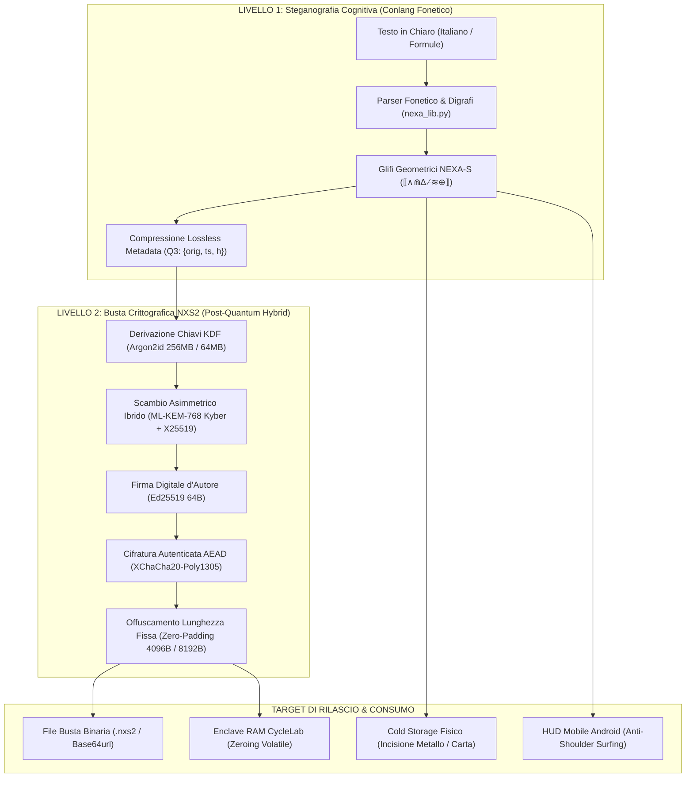
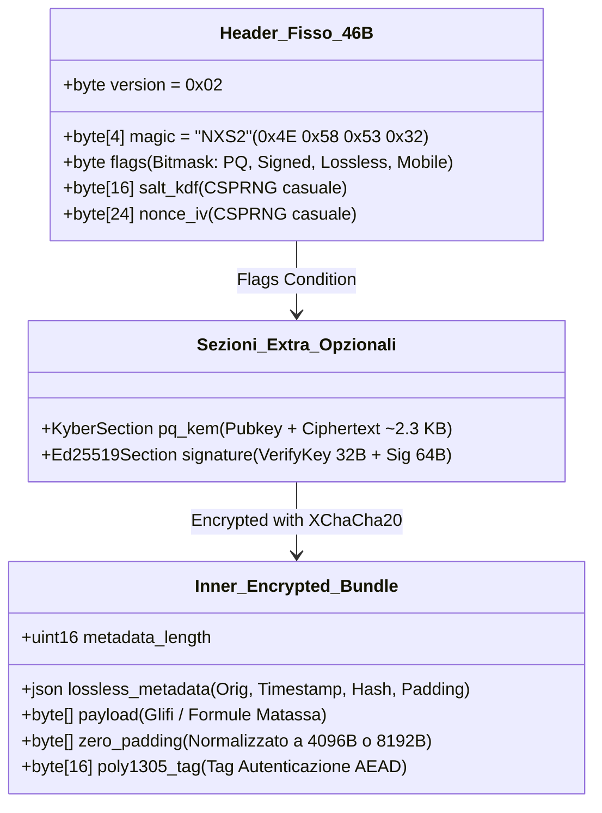
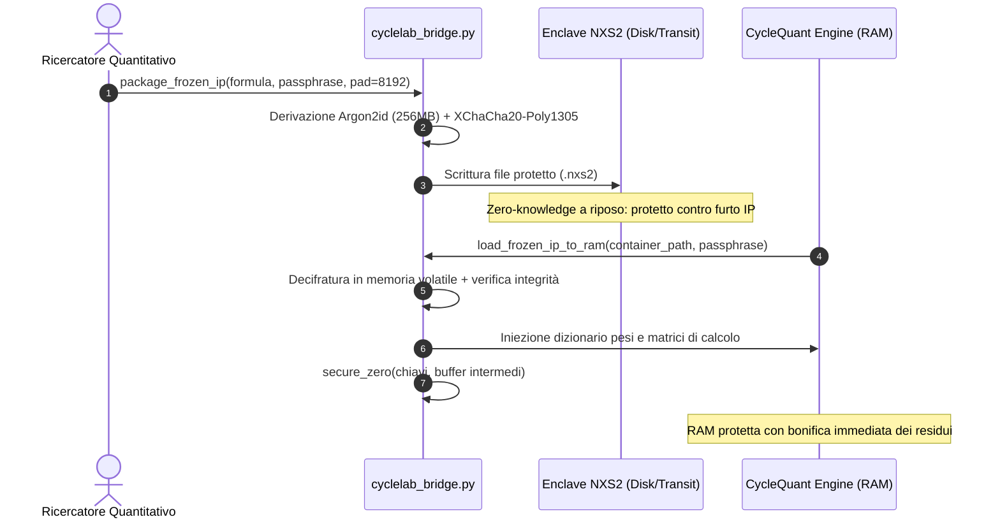
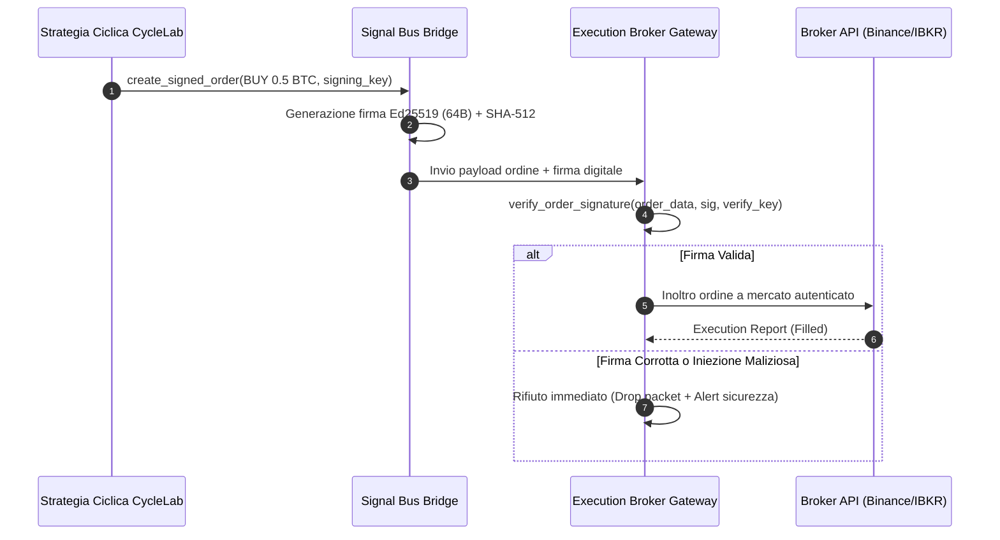
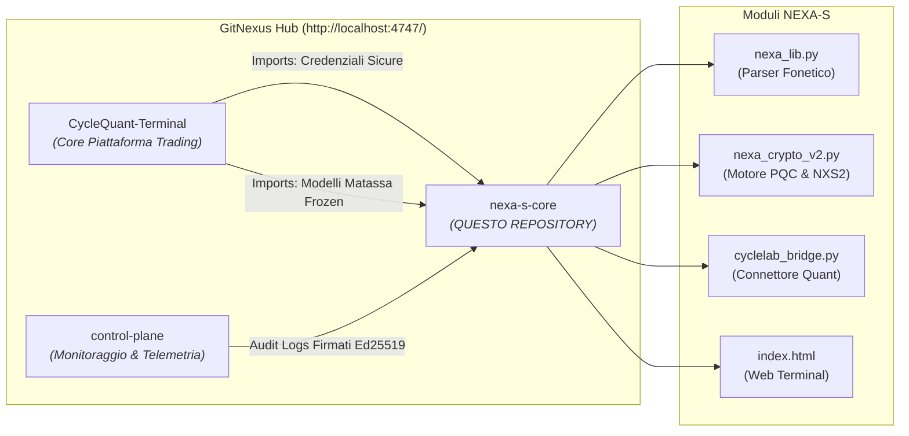

<div align="center">

# ⟦∧⟧ NEXA-S v2.0
### Sovereign Post-Quantum Envelope & Phonetic Cryptography Engine

[](#-architettura-crittografica-nxs2)
[](#)
[-purple.svg)](#)
[-brightgreen.svg)](#-continuous-integration--test-suite)
[](#)
[](#)

*Il primo sistema ibrido di **scrittura fonetica simbolica** e **crittografia autenticata asimmetrica/post-quantum** progettato per la sovranità dei dati personali, cold storage fisico e protezione IP algoritmica.*

[Web Terminal](./index.html) · [CLI v2.0](./nexa_cli_v2.py) · [CycleLab Bridge](./cyclelab_bridge.py) · [Plugin VS Code](./vscode_nexa_s/) · [Plugin Obsidian](./obsidian_nexa_s/) · [CI Runner](./run_ci.py)

</div>

---

## 📋 Indice
- [Cos'è NEXA-S](#-cosè-nexa-s)
- [Perché è Unico](#-perché-è-unico)
- [Architettura Crittografica NXS2](#-architettura-crittografica-nxs2)
- [Tavola Fonetica dei Glifi](#-tavola-fonetica-dei-glifi)
- [Integrazione con CycleLab Terminal](#-integrazione-con-cyclelab-terminal)
- [Mappa Architetturale GitNexus](#-mappa-architetturale-gitnexus)
- [Componenti del Repository](#-componenti-del-repository)
- [Quick Start](#-quick-start)
- [Continuous Integration & Test Suite](#-continuous-integration--test-suite)
- [Governance & Framework Operativo](#-governance--framework-operativo)

---

## 🎯 Cos'è NEXA-S

**NEXA-S** fonde due discipline tradizionalmente separate per creare un sistema di riservatezza a difesa totale:
1. **Steganografia Cognitiva / Scrittura Fonetica Simbolica**: Un conlang di glifi geometrico-fonetici (`⟦∧⋒∆⌿≋⊕⟧`, `⌁⊙⋒ƒ≋⌿⋔⊕ ∴`) che collassa la lingua naturale su fonemi primari. Rende il testo opaco a scraper automatici, telecamere OCR e sguardi indiscreti (*shoulder surfing*).
2. **Crittografia Asimmetrica & Post-Quantum (NXS2)**: Una busta crittografica blindata che implementa lo standard NIST FIPS 203 (**ML-KEM-768 Kyber**), scambio chiavi classico **X25519**, firme digitali **Ed25519**, cifratura simmetrica autenticata **XChaCha20-Poly1305** e KDF memory-hard **Argon2id**.



---

## 🛡️ Perché è Unico

```
                       ┌─────────────────────────────────────┐
                       │   NEXA-S MAXIMUM SECURITY FORMULA   │
                       └──────────────────┬──────────────────┘
                                          │
         ┌───────────────────┬────────────┴────────┬───────────────────┐
         ▼                   ▼                     ▼                   ▼
┌─────────────────┐ ┌─────────────────┐  ┌───────────────────┐ ┌─────────────────┐
│ 1. PQC HYBRID   │ │ 2. AIR-GAP COLD │  │ 3. ZERO-TRACE     │ │ 4. CONSTANT-PAD │
│ ML-KEM-768 +    │ │ GLYPH BACKUP    │  │ RAM PROTECTION    │ │ TRAFFIC ANALYSIS│
│ X25519 + Ed25519│ │ Incisione piastre│ │ mlock() + sodium   │ │ Blind Block     │
│ BLAKE3 Hash     │ │ metallo/carta   │  │ zeroing memoria   │ │ Size Offuscation│
└─────────────────┘ └─────────────────┘  └───────────────────┘ └─────────────────┘
```

1. **Immunità Post-Quantum (FIPS 203)**: Protegge contro la minaccia di *Store Now, Decrypt Later* dei computer quantistici combinando ECDH classico e reticoli algebrici Kyber.
2. **Ripristino Lossless (Q3)**: Il contenitore NXS2 include un blocco metadata compresso e cifrato che ripristina al 100% l'ortografia originale durante la decifratura (doppie, accenti, lettere omofone), preservando l'offuscamento in transito.
3. **Dual Profile Argon2id (Q2)**: 
   - `DESKTOP_VAULT`: 256 MB RAM, 3 iterazioni, 4 thread (massimo hardening server/cold).
   - `MOBILE_TERMINAL`: 64 MB RAM, 3 iterazioni, 2 thread (sblocco <200ms su smartphone).
4. **Traffic Analysis Defense**: Imposizione di blocchi a lunghezza fissa (**4096B - 8192B**) che rendono impossibile desumere la dimensione o il tipo del messaggio intercettato in rete.
5. **Bonifica Volatile `secure_zero()`**: Azzeramento istantaneo dei buffer di memoria in RAM per evitare residui nei file di swap o crash dump.

---

## 🔒 Architettura Crittografica NXS2

Layout binario del contenitore `NXS2`:



---

## 🔤 Tavola Fonetica dei Glifi

La tavola vettoriale completa ad altissima risoluzione è disponibile in [assets/glyph_table.svg](./assets/glyph_table.svg).

| Famiglia | Fonema / Grafema | Glifo NEXA-S | Descrizione Fonetica |
|---|---|:---:|---|
| **Vocali** | `A` (iniziale) | `∧` | Anteriore aperta maiuscola |
| | `a` (standard) | `⊕` | Anteriore aperta standard |
| | `e` / `è` / `é` | `≋` | Anteriore semichiusa |
| | `i` / `y` | `∿` | Anteriore chiusa |
| | `o` / `ò` | `⊙` | Posteriore semichiusa |
| | `u` / `w` | `∪` | Posteriore chiusa |
| **Consonanti** | `b` / `p` | `⊓` / `⌐` | Occlusive bilabiali (sonora / sorda) |
| | `c` / `k` / `g` | `⌁` / `⅁` | Occlusive velari (sorda / sonora) |
| | `d` / `t` | `∆` / `⊥` | Occlusive alveolari (sonora / sorda) |
| | `f` / `v` / `r` | `ƒ` / `⌿` | Fricative labiodentali & vibranti |
| | `s` / `z` | `≈` / `↑` | Fricative & affricate alveolari |
| | `l` / `m` / `n` | `⌯` / `⋔` / `⋒` | Liquide laterali & nasali |
| **Sintassi** | Delimitatore Busta | `⟦ ... ⟧` | Racchiude entità o frasi protette |
| | Notazione Numerica | `⟪ ... ⟫` | Racchiude cifre e valori decimali puri |
| | Punteggiatura / Logica | `∴` / `⇒` / `≥` | Full stop, implicazione, soglie pivot |

---

## 📈 Integrazione con CycleLab Terminal

Il modulo nativo [cyclelab_bridge.py](./cyclelab_bridge.py) fornisce l'integrazione di sicurezza per la piattaforma quantitativa:

1. **Confine IP "Matassa Frozen"**: Cifratura asimmetrica dei pesi armonici di Fourier e delle costanti di pivot non-repainting prima della distribuzione a nodi esecutivi o client mobile.
2. **Caricamento Sicuro in RAM**: Iniezione a runtime direttamente nei dizionari del quant-engine con successiva distruzione sicura della memoria (`secure_zero`).
3. **Signal Bus Non Ripudiabile**: Ordini di compravendita firmati con Ed25519 per prevenire attacchi di *order-injection* tra bot di segnale ed esecutore broker.
4. **Tactical Mobile HUD**: Formattazione discreta degli allarmi ciclici per l'app Android ([CycleLab-Terminal-mobile-v32.apk](file:///C:/Users/Andrea/Desktop/Cycle%20Lab%20App%20mobile)), proteggendo la strategia da chi osserva lo schermo in pubblico.

### Workflow 1: Protezione IP Matassa & Bonifica RAM



### Workflow 2: Trading Signal Bus con Firme Digitali Ed25519



---

## 🗺️ Mappa Architetturale GitNexus

Topologia registrata sul server locale **GitNexus** (`http://localhost:4747/`):



---

## 📂 Componenti del Repository

```
Alfabeto Cryptato/
├── assets/
│   └── glyph_table.svg          # Poster vettoriale ufficiale ad alta risoluzione
├── vscode_nexa_s/               # Estensione VS Code eseguibile (Ctrl+Alt+N / Ctrl+Alt+E)
│   ├── extension.js             # Comandi attivi di traslitterazione, cifratura e decifratura
│   ├── package.json             # Manifesto VS Code esteso
│   ├── language-configuration.json
│   └── nexa-s.tmLanguage.json   # Grammatica per syntax highlighting
├── obsidian_nexa_s/             # Plugin completo per Obsidian Vault
│   ├── main.js                  # Code block processors ```nexa e ```nexa-encrypted
│   ├── manifest.json
│   └── styles.css               # Styling cyberpunk per note personali
├── tests/                       # Suite di test unitari, integrazione e fuzzing (41 test)
│   ├── test_phonetics.py        # Test fonetica, digrammi e validatore sintassi
│   ├── test_crypto_v2.py        # Test AEAD, Ed25519, X25519, dual profile, chaos test
│   ├── test_container_nxs2.py   # Test formato NXS2, lossless metadata, retrocompatibilità
│   ├── test_cyclelab_integration.py # Test Matassa Frozen IP & Mobile HUD
│   └── test_fuzzing_properties.py   # 24 test invarianti e chaos fuzzing massivo
├── index.html                   # Web Terminal interattivo standalone
├── style.css                    # Design system cyberpunk-dark (glassmorphism)
├── app.js                       # Motore client-side (Web Crypto AEAD + Web Audio API)
├── nexa_lib.py                  # Libreria core fonetica bidirezionale
├── nexa_crypto_v2.py            # Modulo crittografico v2.0 Maximum Security
├── nexa_cli_v2.py               # CLI unificata di produzione
├── cyclelab_bridge.py           # Connettore nativo per CycleLab Terminal
├── run_ci.py                    # Runner CI locale one-click conforme al Framework Operativo
├── conftest.py                  # Configurazione path per test discovery
├── mypy.ini                     # Configurazione type checker strict
├── ruff.toml                    # Configurazione linter rapido
└── pyproject.toml               # Configurazione pacchetto Python
```

---

## ⚡ Quick Start

### 1. Web Terminal Interattivo
Fai doppio click su [index.html](./index.html) per aprire direttamente l'app nel tuo browser (Chrome, Edge, Brave, Firefox) senza installare nulla.

### 2. Cifratura e Decifratura da Riga di Comando (CLI v2.0)
```bash
# Cifratura NXS2 con profilo Desktop, padding 4096B e traslitterazione fonetica:
python nexa_cli_v2.py encrypt --in documento.txt --out documento.nexa --profile desktop --nexa --pad 4096

# Cifratura ottimizzata per CycleLab Mobile Terminal:
python nexa_cli_v2.py encrypt --in segnali.json --out segnali.nexa --profile mobile

# Decifratura (ripristino automatico al 100% dell'ortografia originale con Lossless Metadata):
python nexa_cli_v2.py decrypt --in documento.nexa --out documento_decifrato.txt
```

### 3. Utilizzo del Connettore CycleLab
```python
from cyclelab_bridge import CycleLabNexaBridge

bridge = CycleLabNexaBridge(master_passphrase="LaTuaPassphraseSicura!")

# Esporta modello proprietario Matassa Frozen:
pkg = bridge.export_matassa_package(model_weights_dict)

# Inietta direttamente in RAM nel backend FastAPI:
active_model = bridge.load_matassa_package_to_ram(pkg)
```

---

## 🧪 Continuous Integration & Test Suite

Il repository è protetto da una pipeline CI completa conforme a `2_EXECUTION` del Framework Operativo:

Esegui l'intera suite con un solo comando da terminale:
```powershell
python run_ci.py
```

**Esito dei test attuali**:
```text
======================================================================
  ESITO PIPELINE CI NEXA-S v2.0
======================================================================
✓ 1. Pytest Core & Integration Suite (41/41 test superati in ~30s)
✓ 2. Self-Test Modulo Crittografico v2.0 (Dual profile, NXS2, Ed25519)
✓ 3. Self-Test Motore Fonetico v2.0 (Digrammi, blocchi, validatore)
✓ 4. Smoke Test CLI v2.0 Roundtrip & Lossless Restoration
STATO: TUTTI GLI STAGE SUPERATI CON SUCCESSO ✓
CONFORMITÀ: 1_DESIGN (9 Pilastri) & 2_EXECUTION (DoD Tier CRITICO)
```

---

## 🏛️ Governance & Framework Operativo

Il progetto è sviluppato e governato secondo i criteri dell'**Operational Engineering Framework**:
- **`1_DESIGN`**: Copertura totale dei 9 Pilastri di eccellenza ingegneristica (Pre-Mortem, ADR, Blast Radius, Data Lineage NXS2, Idempotenza, Chaos Testing, Circuit Breakers, Security Threat Model, Cost Overhead).
- **`2_EXECUTION`**: DoD di Tier CRITICO rispettata su tutte le modifiche; target di coverage > 80% su moduli core.
- **`FRAMEWORK_MATURITY`**: Target **Livello 4 (Operativo)** raggiunto con suite di test di non-regressione automatizzata e isolamento degli SPOF.

---

<div align="center">

**NEXA-S v2.0 &bull; Proprietà Privata & Confidenziale**  
*Autore: Andrea Finazzi &bull; Sinergia Ecosistema CycleLab & GitNexus*

</div>
